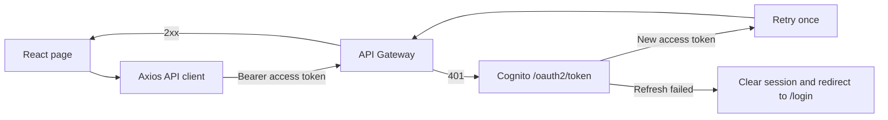

Connect the React application to the authenticated HTTP API, then upload files directly to Amazon S3 using Presigned URLs returned by the backend.

## Create an authenticated API client

The application creates a shared Axios client in `src/lib/apiClient.ts`:

```ts
import axios, {
  AxiosError,
  type InternalAxiosRequestConfig,
} from "axios";
import { authService } from "../services/authService";

interface RetryableRequest extends InternalAxiosRequestConfig {
  _authRetry?: boolean;
}

export const apiClient = axios.create({
  baseURL: import.meta.env.VITE_API_BASE_URL,
  headers: {
    "Content-Type": "application/json",
  },
  timeout: 30_000,
});

apiClient.interceptors.request.use((config) => {
  const accessToken = authService.getToken();

  if (accessToken) {
    config.headers.Authorization = `Bearer ${accessToken}`;
  }

  return config;
});

apiClient.interceptors.response.use(
  (response) => response,
  async (error: AxiosError) => {
    const request = error.config as RetryableRequest | undefined;

    if (
      error.response?.status === 401 &&
      request &&
      !request._authRetry &&
      authService.hasRefreshToken()
    ) {
      request._authRetry = true;

      try {
        const accessToken = await authService.refreshAccessToken();
        request.headers.Authorization = `Bearer ${accessToken}`;
        return apiClient(request);
      } catch {
        authService.clearSession();
        window.location.assign("/login?reason=session_expired");
      }
    }

    return Promise.reject(error);
  },
);
```


## Request flow and automatic token refresh

The access token and refresh token are managed by `authService` in `sessionStorage` using the following keys:

```text
cognito_access_token
cognito_refresh_token
```

A refresh token is issued only when the Cognito App Client is configured to use the Authorization Code flow and the sign-in process returns a refresh token. The application never prints tokens to the console and never sends the refresh token to Amazon API Gateway.



The interceptor only treats HTTP `401` responses as expired session scenarios. CORS errors, network failures, `403`, `404`, and server errors are not treated as expired token errors.

## Implement the document APIs

User operations use the following endpoints:

| Function | Method | Endpoint |
|---|---:|---|
| List documents | `GET` | `/documents` |
| Get document details | `GET` | `/documents/{documentId}` |
| Get scan results | `GET` | `/documents/{documentId}/scan-result` |
| Request an upload URL | `POST` | `/upload-url` |
| Request a download URL | `GET` | `/documents/{documentId}/download-url` |
| Delete a document | `DELETE` | `/documents/{documentId}` |

Example service for listing documents and retrieving document details:

```ts
import { apiClient } from "../lib/apiClient";

export async function getDocuments(limit = 20) {
  const response = await apiClient.get("/documents", {
    params: { limit },
  });

  return response.data;
}

export async function getDocument(documentId: string) {
  const response = await apiClient.get(
    `/documents/${encodeURIComponent(documentId)}`,
  );

  return response.data;
}
```

## Upload files using Presigned URLs

The upload process consists of two requests:

1. Send file metadata to the API to obtain a Presigned URL.
2. Upload the file directly to Amazon S3 using an HTTP `PUT` request.

```ts
import axios from "axios";
import { apiClient } from "../lib/apiClient";

interface UploadUrlRequest {
  fileName: string;
  contentType: string;
  fileSize: number;
}

interface UploadUrlResponse {
  documentId: string;
  uploadUrl: string;
  s3Key?: string;
  expiresIn?: number;
}

export async function requestUploadUrl(file: File) {
  const payload: UploadUrlRequest = {
    fileName: file.name,
    contentType: file.type || "application/octet-stream",
    fileSize: file.size,
  };

  const response = await apiClient.post<UploadUrlResponse>(
    "/upload-url",
    payload,
  );

  return response.data;
}

export async function uploadFileToS3(
  uploadUrl: string,
  file: File,
  onProgress?: (percent: number) => void,
) {
  await axios.put(uploadUrl, file, {
    headers: {
      "Content-Type": file.type || "application/octet-stream",
    },
    timeout: 10 * 60 * 1000,
    onUploadProgress: ({ loaded, total }) => {
      if (total) {
        onProgress?.(Math.round((loaded / total) * 100));
      }
    },
  });
}
```

{}
The `PUT` request to the Amazon S3 Presigned URL does not use `apiClient` and does not include the Cognito access token. The `Content-Type` header must match the content type specified when requesting the Presigned URL.
{}

```text
SAFE
REJECTED
MANUAL_REVIEW
MALWARE_SCAN_ERROR
AI_ERROR
DECISION_ERROR
DELETED
```

Polling also stops when the component is unmounted, the browser goes offline, or the configured timeout is reached. The **Refresh Status** button allows users to retry without creating another upload.

## Download and delete documents

Display the download button only when the document status is `SAFE`, the final decision is `ALLOW`, and the backend returns `downloadAvailable: true`.

```ts
export async function getDownloadUrl(documentId: string) {
  const response = await apiClient.get(
    `/documents/${encodeURIComponent(documentId)}/download-url`,
  );

  return response.data;
}

export async function deleteDocument(documentId: string) {
  const response = await apiClient.delete(
    `/documents/${encodeURIComponent(documentId)}`,
  );

  return response.data;
}
```

The Presigned download URL has a short expiration time. The frontend requests the URL only when the user clicks the download button, then immediately opens the returned URL. The URL must not be stored in local storage or written to the browser console.

## Integrate the administration pages

User management endpoints:

| Function | Method | Endpoint |
|---|---:|---|
| List users | `GET` | `/admin/users` |
| Get user details | `GET` | `/admin/users/{username}` |
| Enable a user | `POST` | `/admin/users/{username}/enable` |
| Disable a user | `POST` | `/admin/users/{username}/disable` |

Document administration endpoints:

| Function | Method | Endpoint |
|---|---:|---|
| List all documents | `GET` | `/admin/documents?status=all&limit=100` |
| Get review details and history | `GET` | `/admin/documents/{documentId}/review` |
| Get preview URL | `GET` | `/admin/documents/{documentId}/preview-url` |
| Submit a review decision | `POST` | `/admin/documents/{documentId}/review` |

Do not call `GET /admin/documents/{documentId}` because the backend does not expose this route. The review details page must retrieve information from the `/review` endpoint, while the document preview must be obtained separately from `/preview-url`.

The review request payload uses `decision` and `reason`:

```ts
type ReviewDecision = "APPROVE" | "REJECT";

interface ReviewRequest {
  decision: ReviewDecision;
  reason: string;
}

export async function submitReview(
  documentId: string,
  payload: ReviewRequest,
) {
  if (payload.reason.trim().length < 10) {
    throw new Error("The review reason must contain at least 10 characters.");
  }

  const response = await apiClient.post(
    `/admin/documents/${encodeURIComponent(documentId)}/review`,
    {
      decision: payload.decision,
      reason: payload.reason.trim(),
    },
  );

  return response.data;
}
```

Unified error handling:

- `401`: End the current session and start the sign-in process again.
- `403`: Display **Access Denied** without exposing the Admin interface.
- `404`: Display **Document Not Found** without revealing ownership information.
- `409`: Reload the document because its processing or review status has changed.
- `429`: Wait and retry using a bounded exponential backoff strategy.
- `5xx`: Display a generic error message and the request ID if provided by the API.

## Verify CORS and the complete workflow

Amazon API Gateway must allow the frontend origin together with the `Authorization` and `Content-Type` headers. The quarantine bucket CORS configuration created in Section 5.3 must allow the `PUT` method.

Test the complete workflow, including user sign-in, paginated document listing, document upload, status polling, document download, document deletion, administrator review, and user management. Verify that AWS credentials, access tokens, Presigned URLs, or untrusted extracted document content do not appear in application logs or browser storage created by your code.