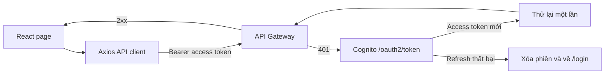

Kết nối ứng dụng React với HTTP API có xác thực, sau đó tải dữ liệu tệp trực tiếp lên Amazon S3 bằng presigned URL do backend trả về.

## Tạo API client có xác thực

Ứng dụng tạo một Axios client dùng chung tại `src/lib/apiClient.ts`:


```ts
import axios, {
  AxiosError,
  type InternalAxiosRequestConfig,
} from "axios";
import { authService } from "../services/authService";

interface RetryableRequest extends InternalAxiosRequestConfig {
  _authRetry?: boolean;
}

export const apiClient = axios.create({
  baseURL: import.meta.env.VITE_API_BASE_URL,
  headers: {
    "Content-Type": "application/json",
  },
  timeout: 30_000,
});

apiClient.interceptors.request.use((config) => {
  const accessToken = authService.getToken();

  if (accessToken) {
    config.headers.Authorization = `Bearer ${accessToken}`;
  }

  return config;
});

apiClient.interceptors.response.use(
  (response) => response,
  async (error: AxiosError) => {
    const request = error.config as RetryableRequest | undefined;

    if (
      error.response?.status === 401 &&
      request &&
      !request._authRetry &&
      authService.hasRefreshToken()
    ) {
      request._authRetry = true;

      try {
        const accessToken = await authService.refreshAccessToken();
        request.headers.Authorization = `Bearer ${accessToken}`;
        return apiClient(request);
      } catch {
        authService.clearSession();
        window.location.assign("/login?reason=session_expired");
      }
    }

    return Promise.reject(error);
  },
);
```


## Luồng request và tự động làm mới token
Access token và refresh token được quản lý bởi `authService` trong `sessionStorage` với các khóa:

```text
cognito_access_token
cognito_refresh_token
```

Refresh token chỉ được cấp khi Cognito App Client cho phép luồng Authorization Code và lần đăng nhập trả về token này. Ứng dụng không in token ra console và không gửi refresh token đến API Gateway.




Interceptor chỉ coi phản hồi HTTP `401` là trường hợp có thể hết phiên. Lỗi CORS, mất mạng, `403`, `404` hoặc lỗi máy chủ không bị chuyển nhầm thành lỗi token hết hạn.

## Triển khai API tài liệu

Các thao tác của người dùng sử dụng những endpoint sau:

| Chức năng | Phương thức | Endpoint |
|---|---:|---|
| Lấy danh sách tài liệu | `GET` | `/documents` |
| Lấy chi tiết tài liệu | `GET` | `/documents/{documentId}` |
| Lấy kết quả quét | `GET` | `/documents/{documentId}/scan-result` |
| Yêu cầu URL tải lên | `POST` | `/upload-url` |
| Yêu cầu URL tải xuống | `GET` | `/documents/{documentId}/download-url` |
| Xóa tài liệu | `DELETE` | `/documents/{documentId}` |

Ví dụ service lấy danh sách và chi tiết:

```ts
import { apiClient } from "../lib/apiClient";

export async function getDocuments(limit = 20) {
  const response = await apiClient.get("/documents", {
    params: { limit },
  });

  return response.data;
}

export async function getDocument(documentId: string) {
  const response = await apiClient.get(
    `/documents/${encodeURIComponent(documentId)}`,
  );

  return response.data;
}
```

## Tải lên bằng presigned URL

Quá trình tải lên gồm hai request:

1. Gửi metadata đến API để nhận presigned URL.
2. Dùng `PUT` tải trực tiếp file lên Amazon S3.

```ts
import axios from "axios";
import { apiClient } from "../lib/apiClient";

interface UploadUrlRequest {
  fileName: string;
  contentType: string;
  fileSize: number;
}

interface UploadUrlResponse {
  documentId: string;
  uploadUrl: string;
  s3Key?: string;
  expiresIn?: number;
}

export async function requestUploadUrl(file: File) {
  const payload: UploadUrlRequest = {
    fileName: file.name,
    contentType: file.type || "application/octet-stream",
    fileSize: file.size,
  };

  const response = await apiClient.post<UploadUrlResponse>(
    "/upload-url",
    payload,
  );

  return response.data;
}

export async function uploadFileToS3(
  uploadUrl: string,
  file: File,
  onProgress?: (percent: number) => void,
) {
  await axios.put(uploadUrl, file, {
    headers: {
      "Content-Type": file.type || "application/octet-stream",
    },
    timeout: 10 * 60 * 1000,
    onUploadProgress: ({ loaded, total }) => {
      if (total) {
        onProgress?.(Math.round((loaded / total) * 100));
      }
    },
  });
}
```

{}
Request `PUT` đến presigned S3 URL không dùng `apiClient` và không gắn Cognito access token. Header `Content-Type` phải giống loại nội dung đã dùng khi yêu cầu presigned URL.
{}

```text
SAFE
REJECTED
MANUAL_REVIEW
MALWARE_SCAN_ERROR
AI_ERROR
DECISION_ERROR
DELETED
```

Cũng dừng khi component unmount, trình duyệt offline hoặc hết thời gian chờ đã định. Nút **Làm mới trạng thái** cho phép người dùng thử lại mà không tạo thêm lần tải lên.

## Tải xuống và xóa tài liệu

Chỉ hiển thị nút tải xuống khi tài liệu có trạng thái `SAFE`, quyết định cuối là `ALLOW` và backend trả `downloadAvailable: true`.

```ts
export async function getDownloadUrl(documentId: string) {
  const response = await apiClient.get(
    `/documents/${encodeURIComponent(documentId)}/download-url`,
  );

  return response.data;
}

export async function deleteDocument(documentId: string) {
  const response = await apiClient.delete(
    `/documents/${encodeURIComponent(documentId)}`,
  );

  return response.data;
}
```

Presigned download URL có thời hạn ngắn. Frontend chỉ yêu cầu URL khi người dùng nhấn tải xuống, sau đó mở URL nhận được; không lưu URL vào local storage hoặc log ra console.

## Tích hợp màn hình quản trị

Các endpoint quản trị người dùng:

| Chức năng | Phương thức | Endpoint |
|---|---:|---|
| Danh sách người dùng | `GET` | `/admin/users` |
| Chi tiết người dùng | `GET` | `/admin/users/{username}` |
| Kích hoạt người dùng | `POST` | `/admin/users/{username}/enable` |
| Vô hiệu hóa người dùng | `POST` | `/admin/users/{username}/disable` |

Các endpoint quản trị tài liệu:

| Chức năng | Phương thức | Endpoint |
|---|---:|---|
| Danh sách toàn bộ tài liệu | `GET` | `/admin/documents?status=all&limit=100` |
| Thông tin và lịch sử kiểm duyệt | `GET` | `/admin/documents/{documentId}/review` |
| Lấy URL xem trước | `GET` | `/admin/documents/{documentId}/preview-url` |
| Gửi quyết định kiểm duyệt | `POST` | `/admin/documents/{documentId}/review` |

Không gọi `GET /admin/documents/{documentId}` vì backend không khai báo route này. Trang chi tiết kiểm duyệt phải lấy dữ liệu từ route có hậu tố `/review`, còn nội dung xem trước lấy riêng từ `/preview-url`.

Payload kiểm duyệt sử dụng `decision` và `reason`:

```ts
type ReviewDecision = "APPROVE" | "REJECT";

interface ReviewRequest {
  decision: ReviewDecision;
  reason: string;
}

export async function submitReview(
  documentId: string,
  payload: ReviewRequest,
) {
  if (payload.reason.trim().length < 10) {
    throw new Error("Lý do kiểm duyệt phải có ít nhất 10 ký tự.");
  }

  const response = await apiClient.post(
    `/admin/documents/${encodeURIComponent(documentId)}/review`,
    {
      decision: payload.decision,
      reason: payload.reason.trim(),
    },
  );

  return response.data;
}
```
Xử lý lỗi thống nhất:

- `401`: kết thúc phiên cũ và bắt đầu đăng nhập lại.
- `403`: hiển thị Access Denied; không làm lộ màn hình Admin.
- `404`: hiển thị không tìm thấy tài liệu mà không tiết lộ quyền sở hữu.
- `409`: tải lại item vì trạng thái xử lý hoặc kiểm duyệt đã thay đổi.
- `429`: chờ và thử lại bằng exponential backoff có giới hạn.
- `5xx`: hiển thị thông báo chung và request ID nếu API cung cấp.

## Kiểm tra CORS và toàn bộ luồng

API Gateway phải cho phép origin frontend cùng `Authorization` và `Content-Type`. Cấu hình CORS của bucket quarantine ở phần 5.3 phải cho phép `PUT` 
Kiểm thử đăng nhập, phân trang danh sách, tải lên, thăm dò trạng thái, tải xuống, xóa, Admin review và quản lý người dùng. Xác nhận AWS key, access token, presigned URL hoặc nội dung trích xuất chưa tin cậy không xuất hiện trong log hay vùng lưu trữ trình duyệt do mã của bạn tạo.
